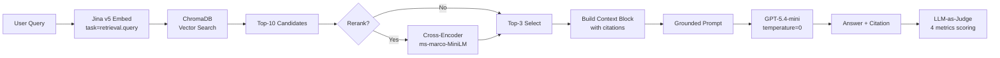

# Architecture — RAG Pipeline (Day 08 Lab)

## 1. Tổng quan kiến trúc

```
[Raw Docs: 5 policy files .txt]
    ↓
[index.py: Preprocess → Chunk → Embed → Store]
    ↓
[ChromaDB Vector Store (cosine similarity)]
    ↓
[rag_answer.py: Query → Retrieve → Rerank → Generate]
    ↓
[Grounded Answer + Citation]
    ↓
[eval.py: Scorecard + A/B Comparison (LLM-as-Judge)]
```

**Mô tả ngắn gọn:**
Hệ thống là trợ lý nội bộ cho khối CS + IT Helpdesk, trả lời câu hỏi về chính sách hoàn tiền, SLA ticket, quy trình cấp quyền và FAQ. Pipeline RAG đảm bảo mọi câu trả lời đều dựa trên chứng cứ được retrieve có kiểm soát, tránh hallucination.

---

## 2. Indexing Pipeline (Sprint 1)

### Tài liệu được index
| File | Nguồn | Department | Số chunk |
|------|-------|-----------| ---------|
| `policy_refund_v4.txt` | policy/refund-v4.pdf | CS | 6 |
| `sla_p1_2026.txt` | support/sla-p1-2026.pdf | IT | 5 |
| `access_control_sop.txt` | it/access-control-sop.md | IT Security | 7 |
| `it_helpdesk_faq.txt` | support/helpdesk-faq.md | IT | 6 |
| `hr_leave_policy.txt` | hr/leave-policy-2026.pdf | HR | 6 |

**Tổng: 30 chunks**

### Quyết định chunking
| Tham số | Giá trị | Lý do |
|---------|---------|-------|
| Chunk size | 400 tokens (~1600 ký tự) | Cân bằng giữa đủ ngữ cảnh và không quá dài cho embedding |
| Overlap | Không dùng (paragraph-based) | Chia theo ranh giới tự nhiên nên overlap không cần thiết |
| Chunking strategy | 2 tầng: Section heading → Paragraph | Ưu tiên giữ nguyên 1 section = 1 chunk. Nếu section quá dài (>1600 ký tự) thì chia tiếp theo `\n\n` (paragraph), fallback `\n` |
| Metadata fields | source, section, effective_date, department, access | Phục vụ filter, freshness check, citation trong answer |

### Embedding model
- **Model**: Jina Embeddings v5 (`jina-embeddings-v5-text-small`) qua REST API
- **Task adapter**: `retrieval.passage` khi index, `retrieval.query` khi search
- **Vector store**: ChromaDB (PersistentClient)
- **Similarity metric**: Cosine

---

## 3. Retrieval Pipeline (Sprint 2 + 3)

### Baseline (Sprint 2)
| Tham số | Giá trị |
|---------|---------|
| Strategy | Dense (embedding similarity) |
| Top-k search | 10 |
| Top-k select | 3 |
| Rerank | Không |

### Variant (Sprint 3)
| Tham số | Giá trị | Thay đổi so với baseline |
|---------|---------|------------------------|
| Strategy | Hybrid (dense fallback) | Thêm BM25 sparse search |
| Top-k search | 10 | Giữ nguyên |
| Top-k select | 3 | Giữ nguyên |
| Rerank | Cross-encoder (ms-marco-MiniLM-L-6-v2) | Bật rerank sau retrieve |

**Lý do chọn variant hybrid + rerank:**
Corpus có cả câu tự nhiên (policy, quy trình) lẫn keyword/mã chuyên ngành (P1, Level 3, ERR-403). Dense embedding có thể bỏ lỡ exact match cho các keyword này. Hybrid kết hợp BM25 để bắt keyword chính xác. Rerank giúp lọc noise từ kết quả search rộng, đảm bảo chỉ top-3 chunk tốt nhất được đưa vào prompt.

---

## 4. Generation (Sprint 2)

### Grounded Prompt Template
```
Answer only from the retrieved context below.
If the context is insufficient, say you do not know.
Cite the source field (in brackets like [1]) when possible.
Keep your answer short, clear, and factual.
Respond in the same language as the question.

Question: {query}

Context:
[1] {source} | {section} | score={score}
{chunk_text}

[2] ...

Answer:
```

### LLM Configuration
| Tham số | Giá trị |
|---------|---------|
| Model | gpt-5.4-mini (OpenAI) |
| Temperature | 0 (output ổn định cho eval) |
| Max tokens | 512 |

---

## 5. Evaluation (Sprint 4)

### Scoring method: LLM-as-Judge
Dùng OpenAI gpt-4o-mini làm judge tự động cho 3 metrics:
- **Faithfulness**: Answer có bám đúng context hay bịa?
- **Answer Relevance**: Answer có trả lời đúng câu hỏi?
- **Completeness**: Answer có đủ thông tin so với expected?

Metric thứ 4 — **Context Recall** — tính tự động bằng code: kiểm tra expected sources có nằm trong retrieved chunks không.

### A/B Comparison
So sánh baseline (dense, no rerank) vs variant (hybrid, rerank) trên cùng 10 test questions. Chỉ đổi MỘT biến mỗi lần.

---

## 6. Failure Mode Checklist

| Failure Mode | Triệu chứng | Cách kiểm tra |
|-------------|-------------|---------------|
| Index lỗi | Retrieve về docs cũ / sai version | `inspect_metadata_coverage()` trong index.py |
| Chunking tệ | Chunk cắt giữa điều khoản | `list_chunks()` và đọc text preview |
| Retrieval lỗi | Không tìm được expected source | `score_context_recall()` trong eval.py |
| Generation lỗi | Answer không grounded / bịa | `score_faithfulness()` trong eval.py |
| Token overload | Context quá dài → lost in the middle | Kiểm tra độ dài context_block |

---

## 7. Pipeline Diagram


